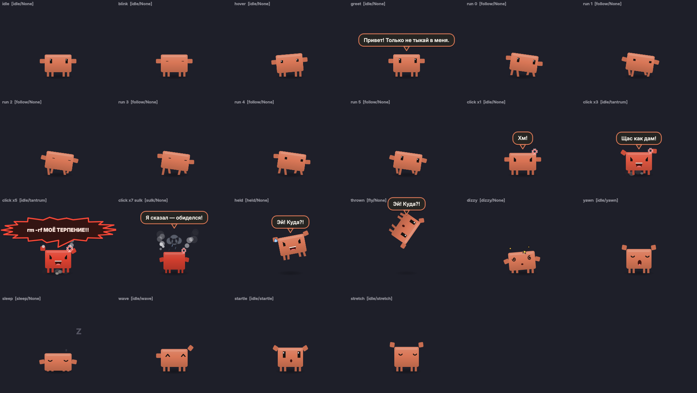

# Clawd — питомец Claude Code для рабочего стола

Маленький оранжевый Clawd живёт у вас на экране: бегает за курсором, **злится, если в него тыкать**, а ещё умеет работать как полноценный агент Claude Code — голосом.



## Что умеет

**Питомец**
- Бегает за мышкой, в том числе между мониторами, и не мешает кликать: клики везде, кроме него самого, проходят насквозь.
- Моргает, оглядывается, притопывает, зевает и засыпает, если мышь долго не трогать.
- Злится при кликах всё сильнее: краснеет, топает, машет кулачками, пыхтит паром; если довести — обижается.
- Можно схватить и швырнуть — у него закружится голова.
- Вылезает из-за панели при включении и ныряет за неё при выключении (клик по значку в трее).
- Прячется в полноэкранных окнах и когда выключен композитинг.

**Мозги (необязательно)**
- Откликается на имя «Клод» / «Claude» или на среднюю кнопку мыши и слушает задачу голосом.
- Выполняет её через Claude Code: отвечает, пишет код, запускает команды.
- Отвечает вслух нейроголосом и одновременно в облачке.
- По просьбе управляет собой: «побегай», «уйди влево», «стань больше», «перейди на другой монитор», «замолчи»…

Модель, глубина размышления, режим доступа, голос и язык выбираются в меню «Мозги Clawd».

## Требования

- Linux, сессия **X11** с композитингом (проверено на KDE Plasma 6).
- Python 3.10+ и PySide6.

```bash
pip install --user PySide6
```

Для голоса и мозгов дополнительно:

```bash
pip install --user vosk piper-tts edge-tts SpeechRecognition
```

- [Claude Code](https://claude.com/claude-code) (CLI `claude` или расширение VS Code) с подпиской — это «мозг».
- Модели распознавания Vosk в `~/.local/share/clawd-pet/`:
  [vosk-model-small-ru-0.22](https://alphacephei.com/vosk/models/vosk-model-small-ru-0.22.zip),
  [vosk-model-small-en-us-0.15](https://alphacephei.com/vosk/models/vosk-model-small-en-us-0.15.zip).
- Для офлайн-голоса — голоса Piper (`ru_RU-denis-medium`, `en_US-ryan-medium`) в `~/.local/share/clawd-pet/voices/`.
- `parecord` (PulseAudio/PipeWire) и `ffplay` (ffmpeg).

**Приватность:** слово «Клод» и текст в облачке пока вы говорите распознаются офлайн. Готовая фраза для точности отправляется в бесплатное распознавание Google, а озвучка по умолчанию идёт через голоса Microsoft Edge. Без интернета используются офлайн-варианты (Vosk и Piper).

## Запуск

```bash
python3 clawd.py                 # запустить; повторный запуск зовёт питомца к курсору
python3 clawd.py --toggle        # выпустить / спрятать
python3 clawd.py --listen        # начать слушать
python3 clawd.py --do "run 5"    # команда самому Clawd (см. ниже)
python3 clawd.py --quit          # выключить
python3 clawd.py --install       # ярлык в меню приложений
```

Команды `--do`: `size S|M|L`, `follow|phrases|tts|wake|fullscreen on|off`, `voice …`, `model …`, `effort …`, `mode …`, `hide`, `show`, `summon`, `goto left|right|top|bottom|center|<угол>|cursor|X Y`, `run [сек]`, `jump`, `wave`, `stretch`, `sleep`, `monitors`, `monitor next|N`.

Настройки — в `~/.config/clawd-pet/config.json`. Личные дополнения к характеру и правилам агента можно написать в `~/.config/clawd-pet/prompt_extra.txt`. Журнал работы агента — `~/.local/share/clawd-pet/agent.log`.

## Лицензия

MIT. Clawd — маскот Claude Code от Anthropic; это неофициальный фанатский проект.
